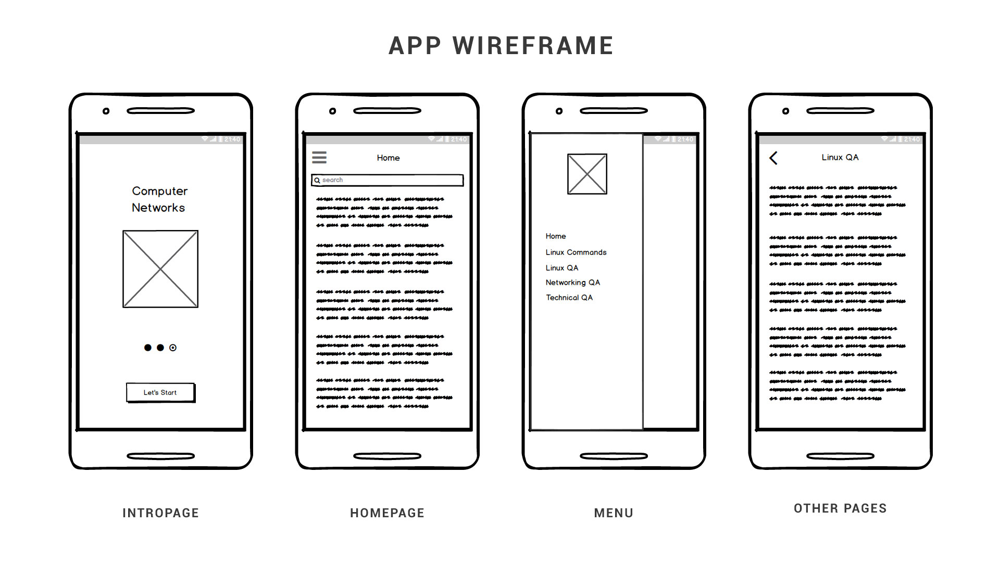
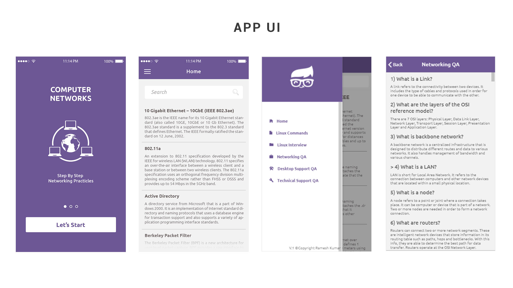

# Ionic3 & Angular4 Network Dictionary App

Network Dictionary App built in Ionic3 and Angular4. In this app 5000+ network terms, words are added and its search function searches content using angular providers from JSON file. the app has lots of another information page which provides some tech information.

## Getting Started

1. IntroPage
2. Homepage
3. Search Bar
4. Menu
5. Other Information Pages

### Prerequisites

1. Ionic3
2. Angular4

### Installing

1. Download the installer for Node.js 6 or greater.
2. Install the ionic CLI globally: npm install -g ionic
3. Clone this repository: git clone https://github.com/ajayrandhawa/Ionic3-Network-Dictionary-App.git
4. Run npm install from the project root.
5. Run ionic serve in a terminal from the project root

## ADD Content

```
\src\providers\data\data.ts

this.items = [
             {
               title: " ",
               description: " "
            },

            {
              title: "",
              description:""
            }
            ];
            
```

## App Wireframe



## App UI



## App Running View


## Version

2.0

## Authors

Ajay Randhawa
